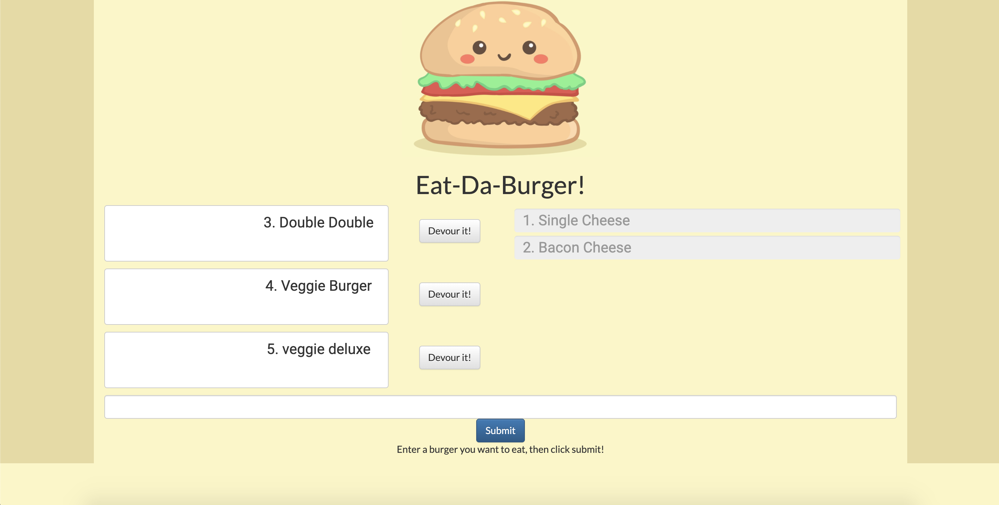

# Eat-Da-Burger!
A simple app using node, express & express handlebars, sql and orm to allow the user to either choose from a pre-generated list of burgers to eat, see what has already been eaten or input and eat one of their own!

## Example

## Heroku
* [Click here for Heroku deployment](https://git.heroku.com/arcane-harbor-12851.git)

### User Story
* As a person that's hungry
* I want to view my burger options
* So that I can add my own or choose what's available
